# Catflix (TM)

## Table of Contents
- [Instructions](#instructions)
- [1. Add Command](#1-add-command)
- [2. Delete Command](#2-delete-command)
- [3. Patch Command](#3-patch-command)
- [4. Post Command](#4-post-command)
- [5. Server Side](#5-server-side)
- [6. Answers to the questions in Targil 2](#6-answers-to-the-questions-in-targil-2)

## Instructions

1. Clone the repository -
  
  git clone https://github.com/doronkon/catflix.git
  
2. Enter the file -
   
   cd Catflix
   
3. Create an image -
  
  docker build -t catflix .
  
4. To run the tests -
   
   docker run catflix /Catflix/build/runTests
   
5. To run the app -
   
   docker run -it catflix /Catflix/build/Catflix_app
   

## 1. Add Command

1. *updateUserMovies function* - updates the data in the file after using add

2. *execute function* - creates or updates a user then updates the data in usersData.txt
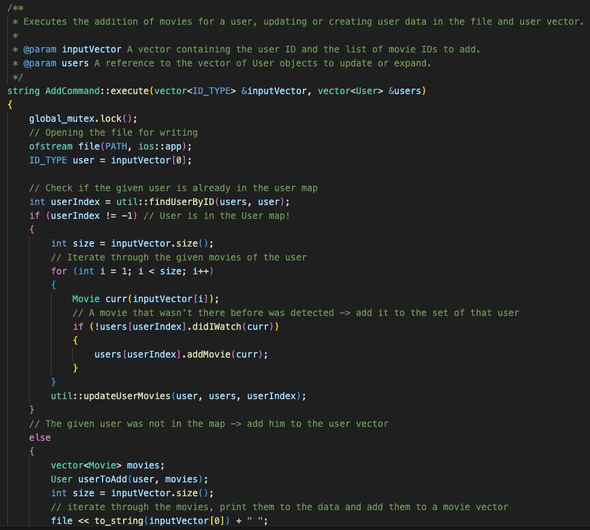

## 2. Delete Command

1. *IsValid* checks if the input for "Delete" command is valid and returns an output 404\400 in case of a bad input or 0 for a valid input
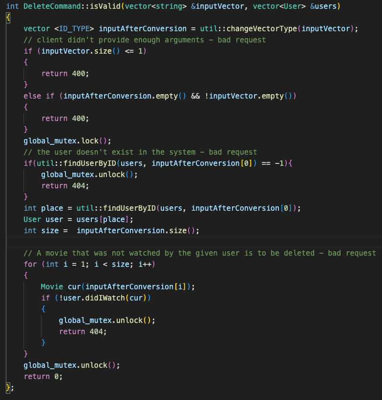

2. *Execute* removes a given movie from a given user, updates the database as well
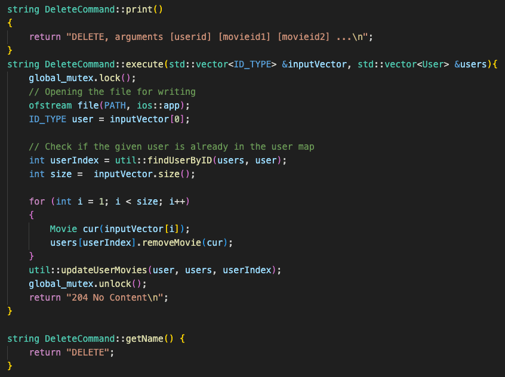

## 3. Patch Command

1. *IsValid* checks if the input for "Patch" command is valid and returns an output 404\400 in case of a bad input or 0 for a valid input
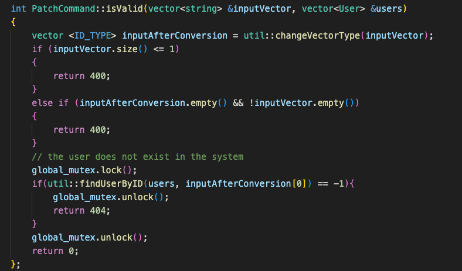

2. *Execute* - use Add command's execute and than return the requested output
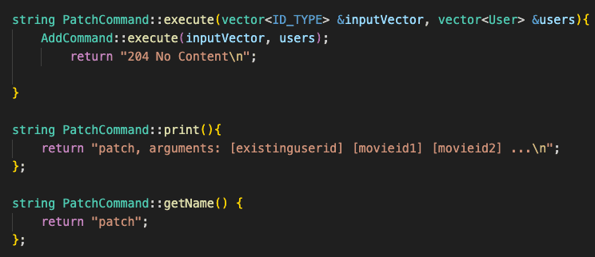

## 4. Post Command

1. *IsValid* checks if the input for "Post" command is valid and returns an output 404\400 in case of a bad input or 0 for a valid input
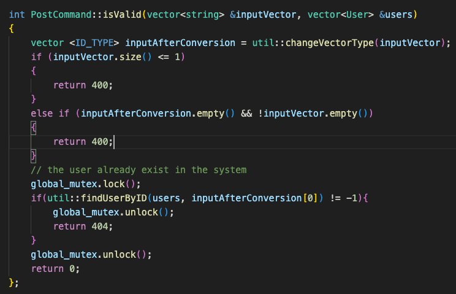

2. *Execute* - use Add command's execute and than return the requested output
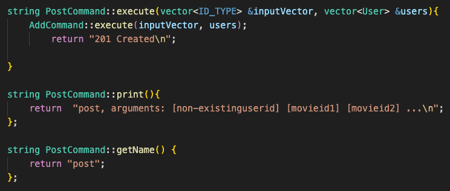

## 5. Server side

1. *create_connection* a function that accepts connections from clients and returns their socket
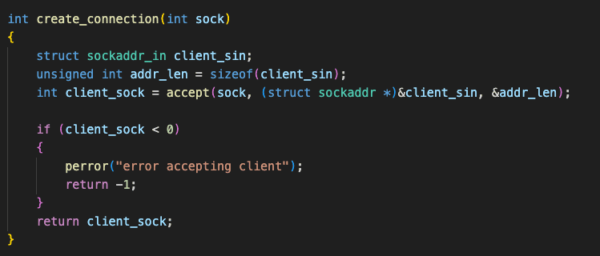

2. *handlingThread* - each thread is handled in this function - it is the server itself - what recives, handles and send back the responses
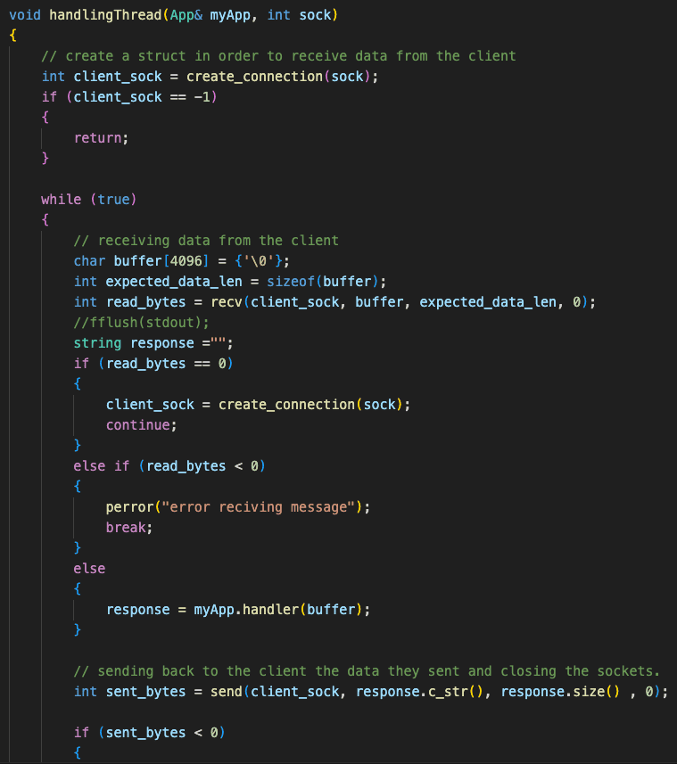
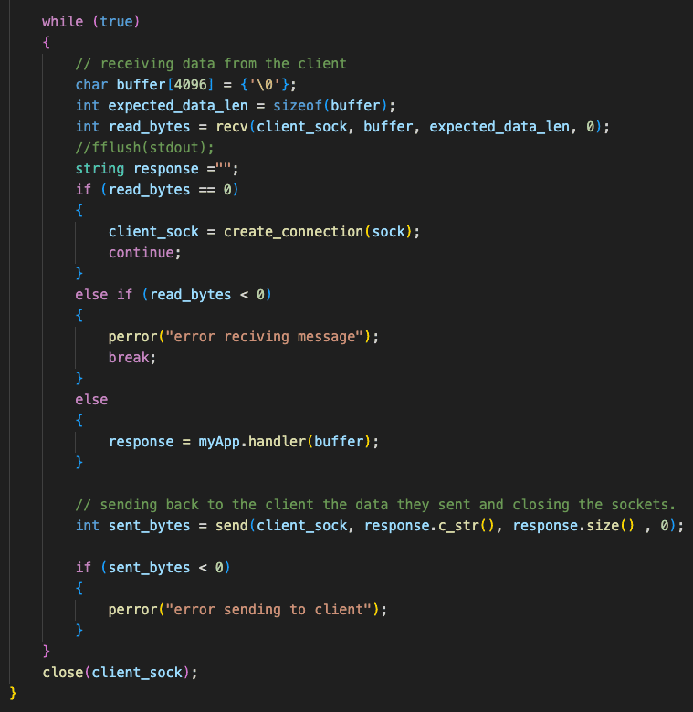

4. *main* - inside the main function we start up the server and necessery threads that will accept clients in the future
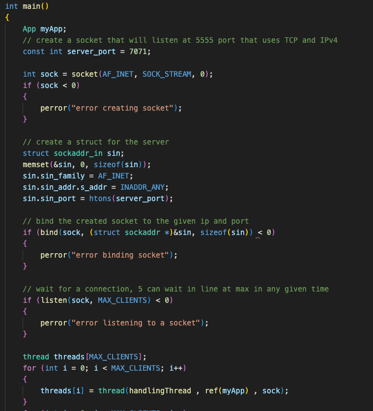
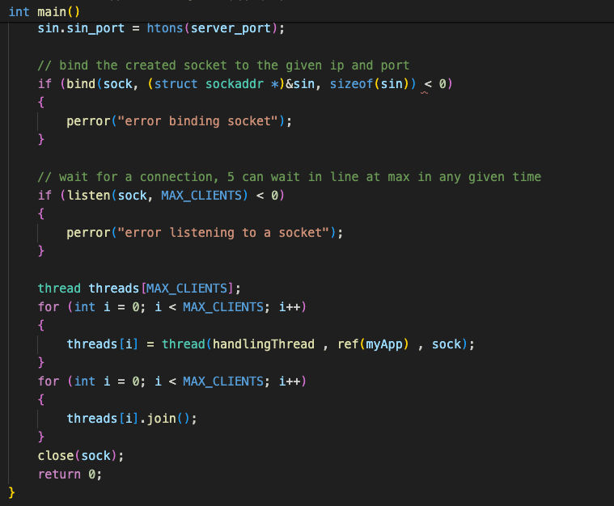

## 6. Answers to the questions in Targil 2

1. The fact that the name of the functions changes in this targil didn't change much of our code since we use a Command map.
   Thanks to this implementation the only necessary change was the keys of the map.
   
2.  The newly added commands did not make us change older code - we were able to expand upon our older functions easly.
   Patch and Post are a good example - they both have the same funcionality almost entirely - we defined them as expending "AddCommad" so they'll use the old execute and that is basically it.
    
3.  the fact the the input is now provided through a socket rather than the console didn't impact our code much, instead of using getLine, we received the input through the client
   
### Repository Link - [https://github.com/doronkon/catflix.git]