# Catflix (TM)

## Instructions
running server:
docker-compose up server --build
opens a new client:
docker-compose run -it client

running server:
cd Catflix
g++ -std=c++17 -I./include -o server $(find src -name "*.cpp")
./server

running client:
cd /Catflix/src/ClientSide
python3 client.py 127.0.0.1 7071

1. Clone the repository -
  ```
  git clone https://github.com/doronkon/catflix.git
  ```
2. Enter the file -
   ```
   cd Catflix
   ```
3. Create an image -
  ```
  docker build -t catflix .
  ```
4. To run the tests -
   ```
   docker run catflix /Catflix/build/runTests
   ```
5. To run the app -
   ```
   docker run -it catflix /Catflix/build/Catflix_app
   ```

## 1. Add Command

1. **updateUserMovies function** - updates the data in the file after using add
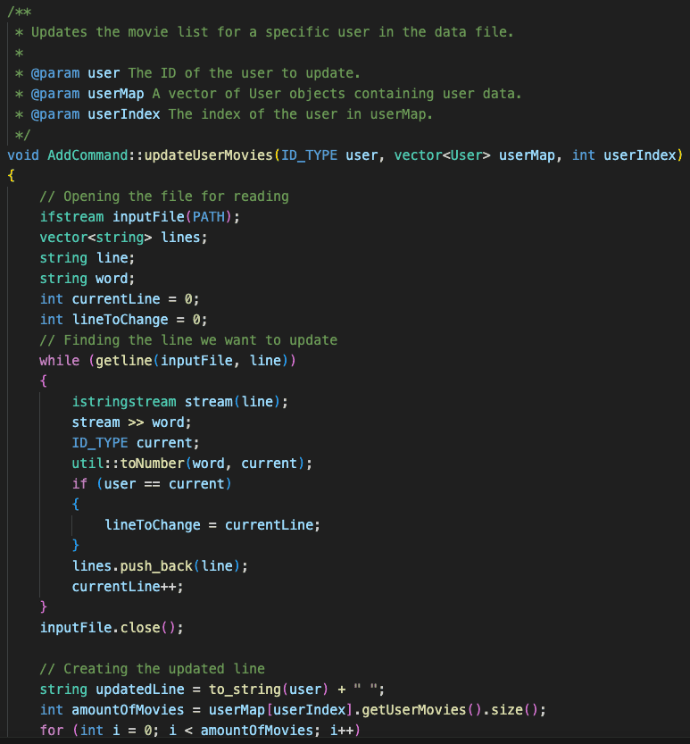
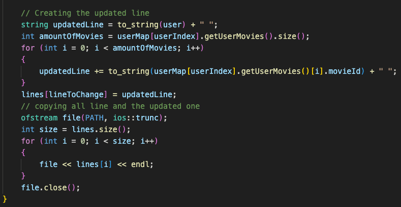

2. **execute function** - creates or updates a user then updates the data in usersData.txt
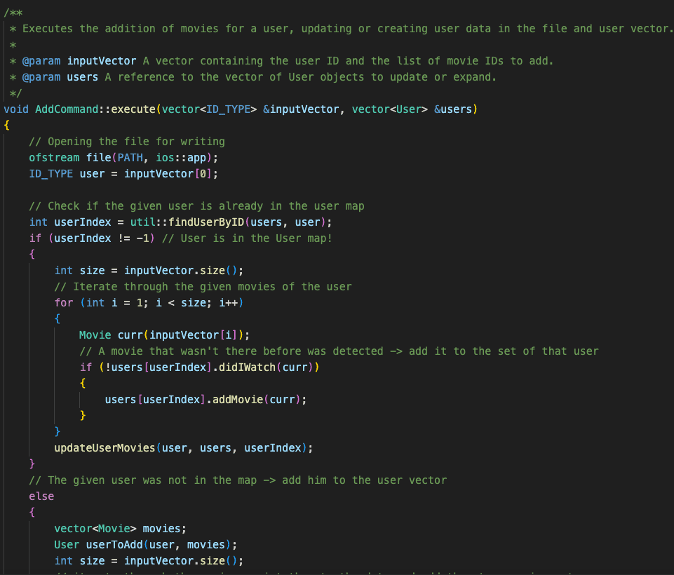
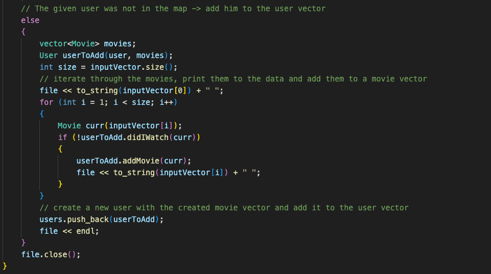

3. **isValid and print function** - print is used by help (all commands have a print function which help initiates while it runs), isValid validates the input of each command
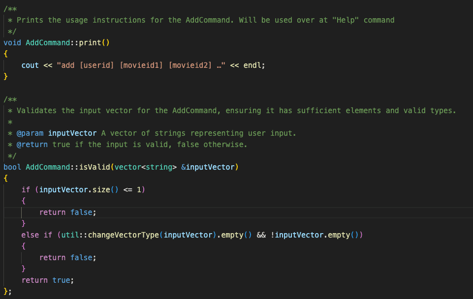

## 2. Help Command

1. **help** initiates all "print" functions which every command has including itself, execute initiates exactly that, and addCommand adds a given command to the command list of Help
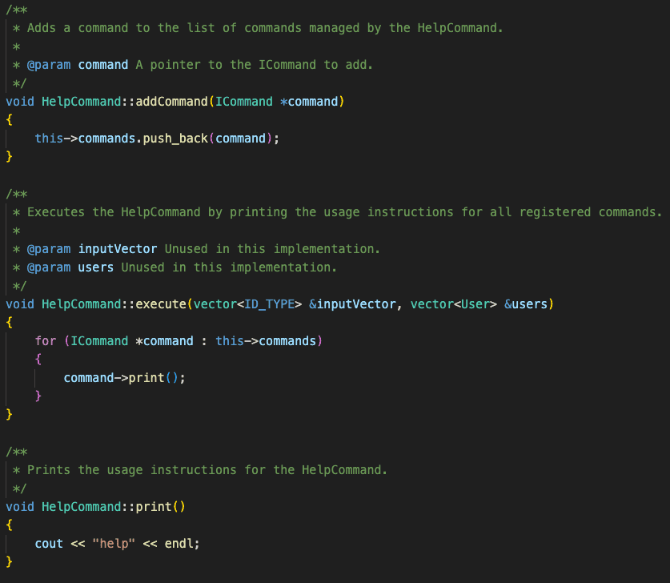

2. **isValid** validates the arguments given to the help command
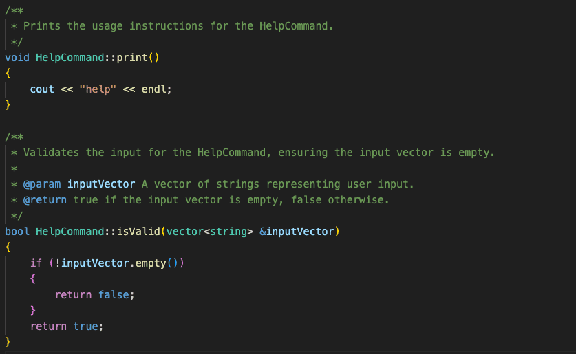

## 3. Recommend Command

1. **print function** - used by help
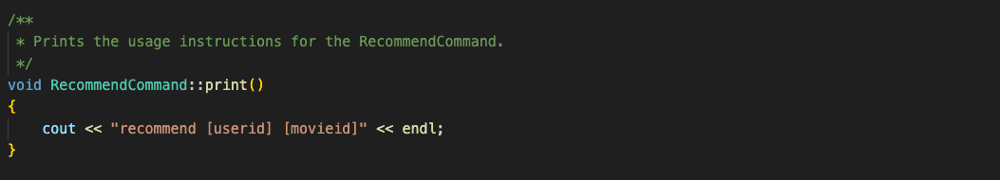

2. **findCommonMovies** - finds the "weight" each user should get in the recommendation algorithm
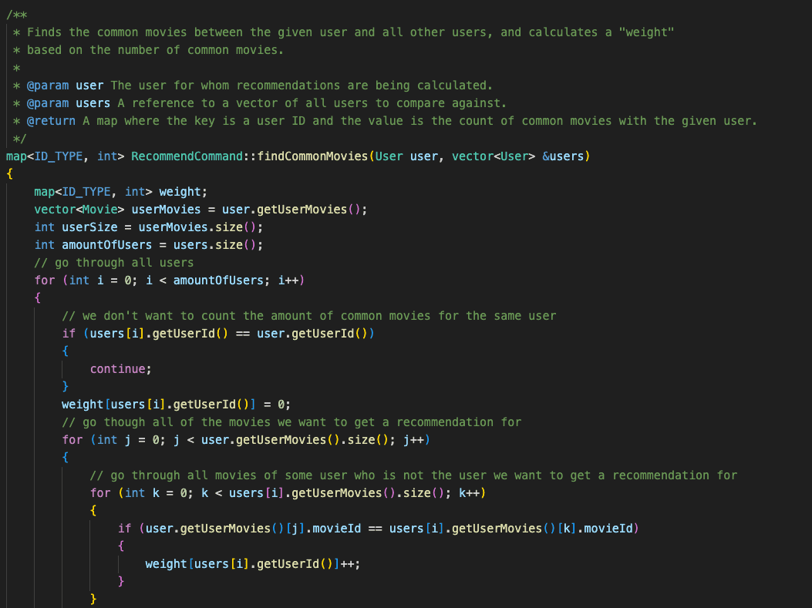
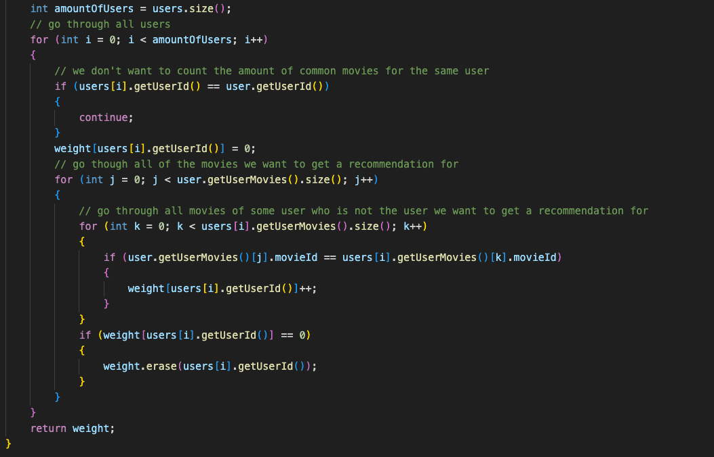

3. **filterUsers function** - filters out the users who did not watch the movie we want to make a recommendation by
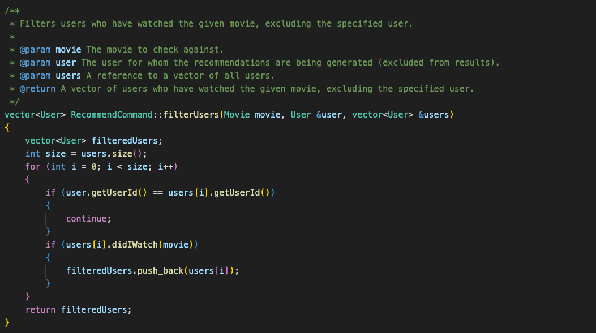

4. **filterMovies** - takes the movies from the filtered users which our user still has not watched
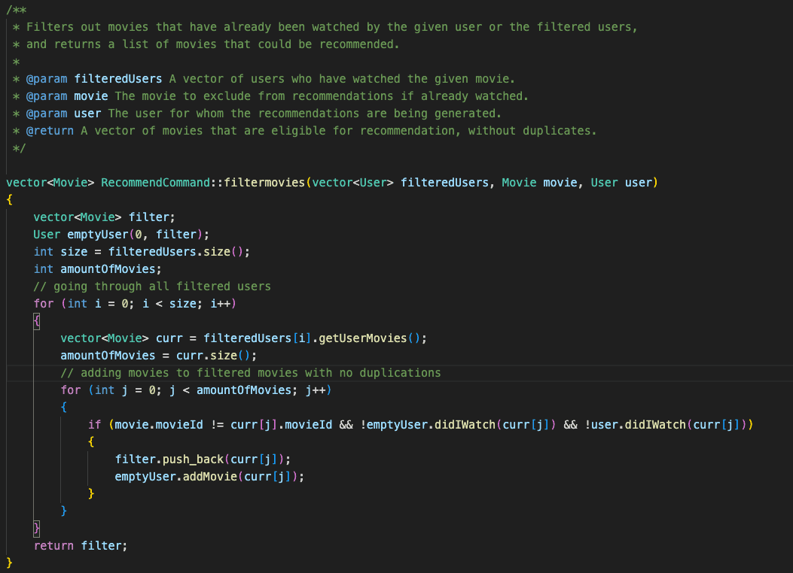

5. **makingRating** - calculates movie ratings based on the weights of the filtered users' movies
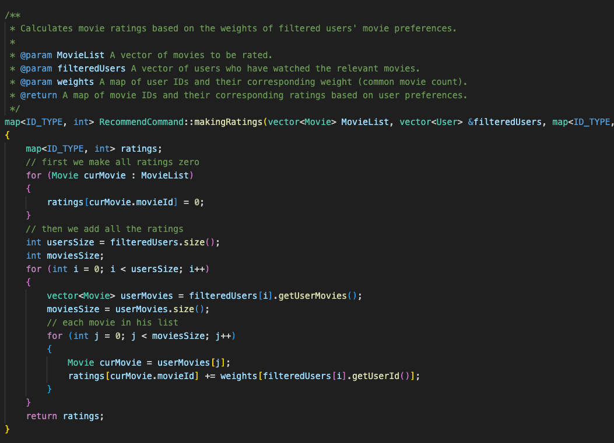

6. **sortingMovies** - stable sort for the required Recommend function printing
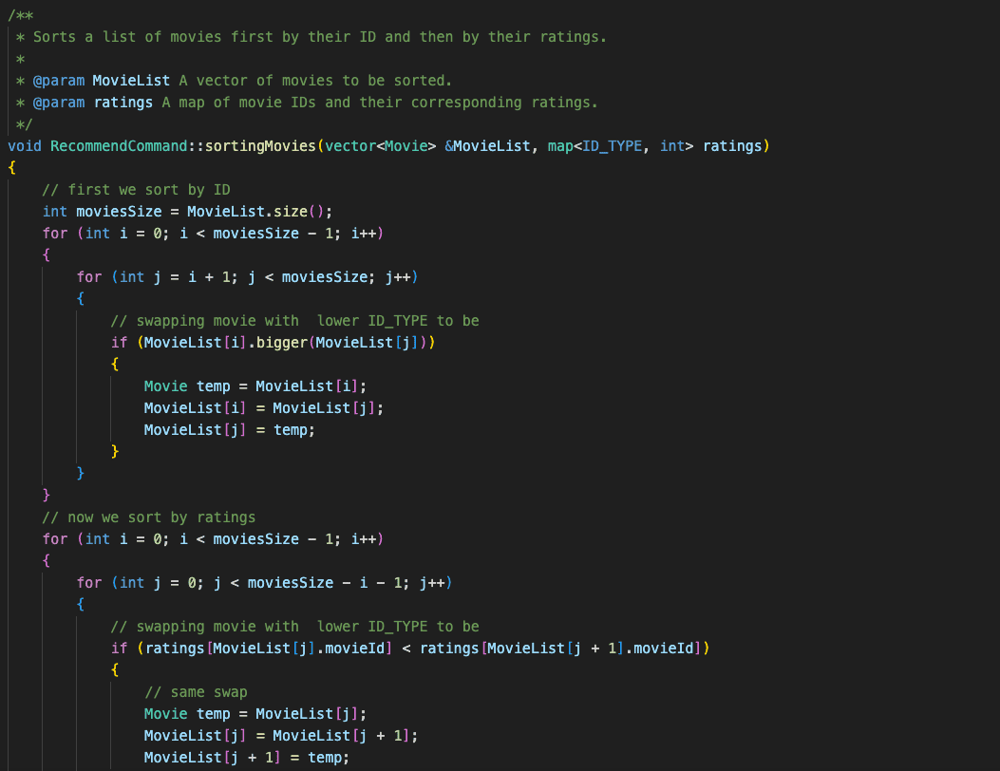
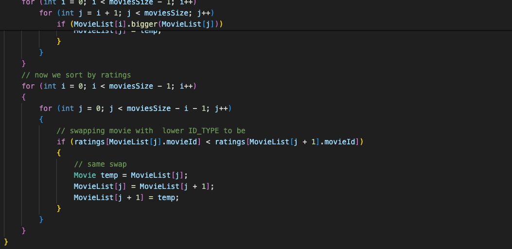

7. **execute** - starts the recommendation process
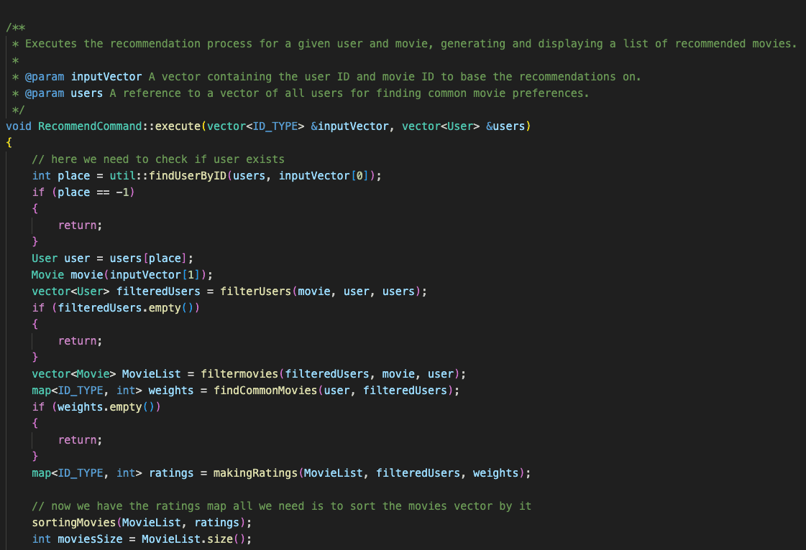
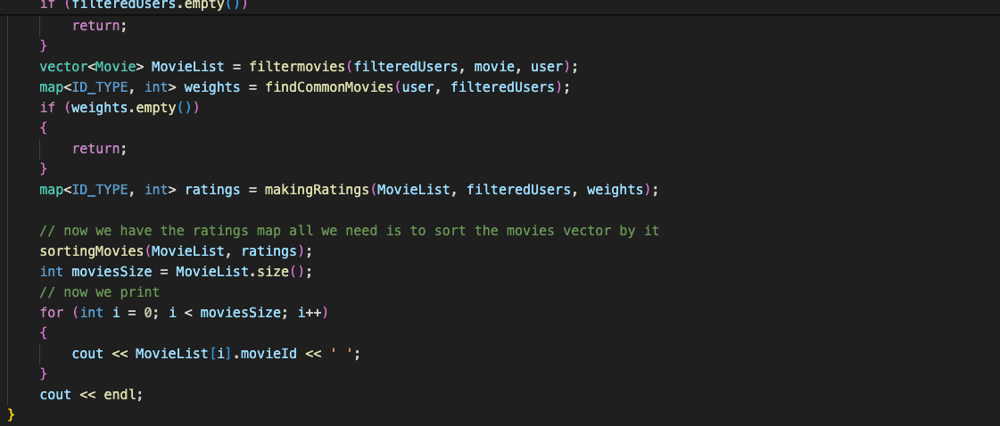

8. **isValid** - validates the input for the recommend command
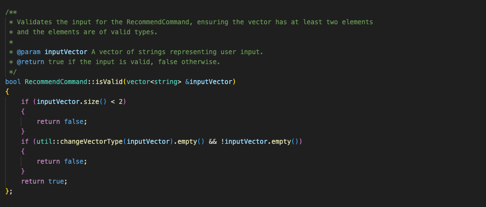

### Repository Link - [https://github.com/doronkon/catflix.git](https://github.com/doronkon/catflix.git)
