# Catflix (TM)

## Table of Contents
- [Instructions](#instructions)
- [1. User Commands](#1-user-commands)
- [2. Category Commands](#2-category-commands)
- [3. Movie Commands](#3-movie-commands)
- [4. Recommend Commands](#4-recommend-commands)

## Instructions

1. Clone the repository -
  ```
  git clone https://github.com/doronkon/catflix.git
  ```
2. Enter the file -
   ```
   cd Catflix
   ```
3. running server:
   ```
   docker-compose up server --build
   ```
4. opens a new client:

   4.1 - Open a new terminal
   
   4.2 Enter the file -
   ```
   cd Catflix
   ```
   4.3 - Run the new client
   ```
   docker-compose run -it client
   ```
5. build tests:
   ```
   docker build -t catflix-tests -f Dockerfile.tests .
   ```
6. run tests:
   ```
   docker run catflix-tests
   ```
* All commands are upper case except help command.

## 1. user commands

1. *Create user* - creates a new user
   ```
   curl -i -X POST http://localhost:12345/api/users \
    -H "Content-Type: application/json" \
    -d '{"name": "<give_a_user_name>", "password":"<give_a_password>"}'
   ```
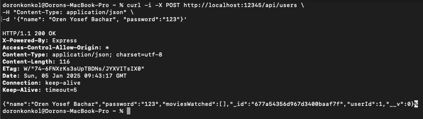

2. *Patch user* - patching a user
   ```
    curl -i -X PATCH http://localhost:12345/api/users/<mongo_ID_of_the_user_to_patch> \
    -H "user: <mongo_ID_of_user>" \
    -H "Content-Type: application/json" \
    -d '{"name": "<a_new_name>" "movie" : "<ID_Of_a_movie_to_add> ... }'
   ```
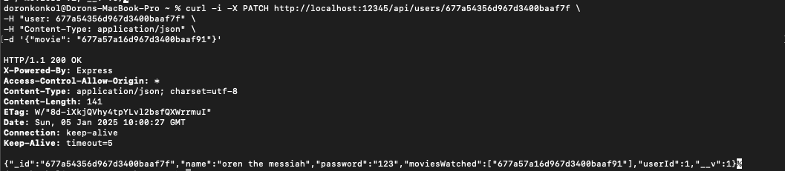

3. *Get specific user* - Getting a specific user
   ```
    curl -i http://localhost:12345/api/users/<Mongo_Id_of_user> \
    -H "user: <Mongo_Id_of_user>" \
    -H "Content-Type: application/json"
   ```
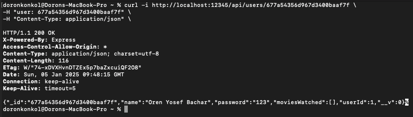

4. *Get all user* - Getting all user
   ```
   curl -i -X GET http://localhost:12345/api/users \
    -H "user: <actual_mongo_user_id>" \
    -H "Content-Type: application/json"
   ```
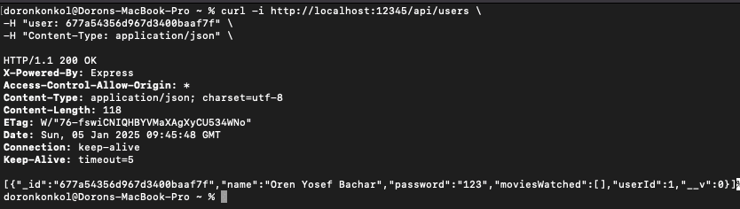

5. *Delete user* - Delete a user
   ```
   curl -i -X DELETE http://localhost:12345/api/users/<Mongo_ID_of_the_user_to_delete> \
    -H "user: <Mongo_ID_of_the_user>" \
    -H "Content-Type: application/json"
   ```
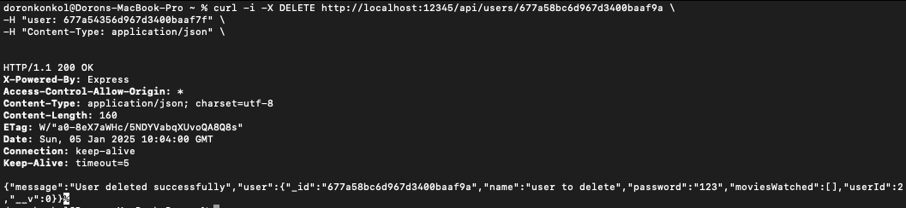

## 2. Category commands

1. *Create Category* - creates a new category
   ```
   curl -i -X POST http://localhost:12345/api/categories \
    -H "user: <Mongo_ID_of_the_user>" \
    -H "Content-Type: application/json" \
    -d '{"name": "<name_of_the_category>", "promoted": <true/false>}'
   ```
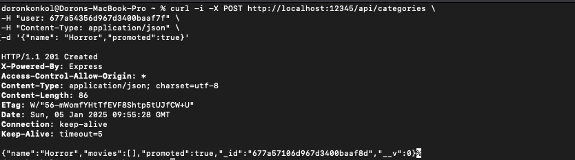

3. *Patch category* - patching a category
   ```
   curl -i -X PATCH http://localhost:12345/api/categories/<ID_of_the_category_to_change> \
    -H "user: <Mongo_ID_of_the_user>" \
    -H "Content-Type: application/json" \
    -d '{"name": "New Category Name"...}'
   ```
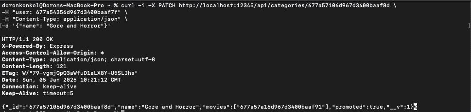

5. *Get categories* - Getting all categories
   ```
   curl -i http://localhost:12345/api/categories \
    -H "user: <Mongo_ID_of_the_user>" \
    -H "Content-Type: application/json"
   ```
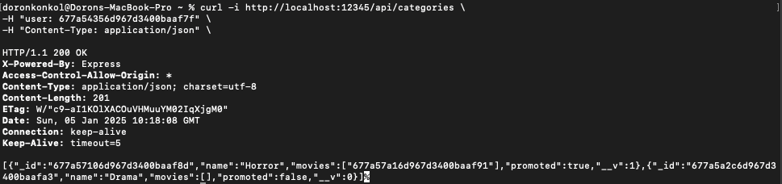

6. *Delete category* - Delete a category
   ```
   curl -i -X DELETE http://localhost:12345/api/categories/<Mongo_ID_of_the_category_to_delete> \
    -H "user: <Mongo_ID_of_the_user>" \
    -H "Content-Type: application/json"
   ```
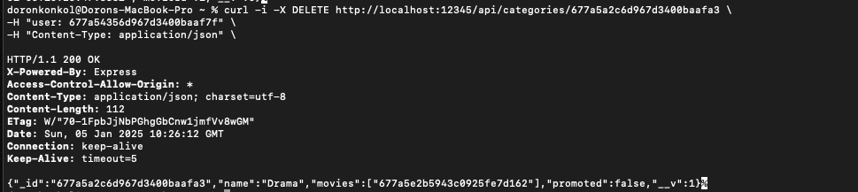

## 3. Movie Commands

1. *Create Movie* - creates a new movie
   ```
    curl -i -X POST http://localhost:12345/api/movies \    
    -H "user: <Mongo_ID_of_the_user>" \
    -H "Content-Type: application/json" \
    -d '{"name": "<name_of_the_film>", "category": "<Mongo_ID_of_the_category>" , ...}'
   ```
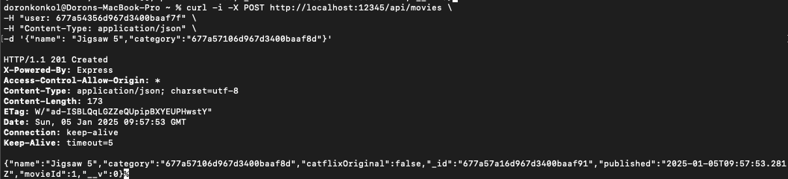

3. *Get recommendation for movies* - Get recommendation for movies
   ```
    curl -i http://localhost:12345/api/movies \    
    -H "user: <Mongo_ID_of_the_user>" \
    -H "Content-Type: application/json"
   ```
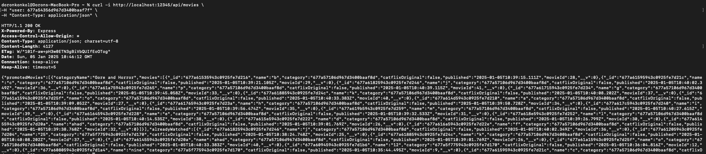

5. *Get movie* - Getting a specific movies
   ```
    curl -i http://localhost:12345/api/movies/<ID_of_the_movie> \    
    -H "Content-Type: application/json"
   ```


7. *Delete Movie* - Delete a Movie
   ```
    curl -i -X DELETE http://localhost:12345/api/movies/<ID_of_the_movie> \
    -H "user: <ID_of_a_user_in_mongo>" \
    -H "Content-Type: application/json"
   ```
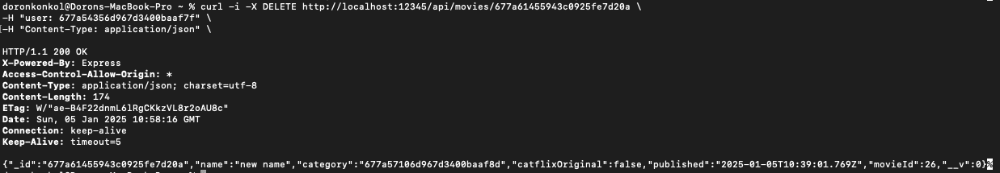

5. *Patch Movie* - Patch a Movie
   ```
    curl -i -X PATCH http://localhost:12345/api/movies/<ID_of_the_movie> \
    -H "user: <ID_of_a_user_in_mongo>" \
    -H "Content-Type: application/json" \
    -d '{"name": "<new_name>" , ...}'
   ```

## 4. Recommend commands

1. *Post* - inserts a movie for a given user into the cpp recommensation system
   ```
    curl -i -X POST http://localhost:12345/api/movies/<ID_of_movie>/recommend \
    -H "user: <ID_of_a_user_in_mongo>" \
    -H "Content-Type: application/json"

   ```
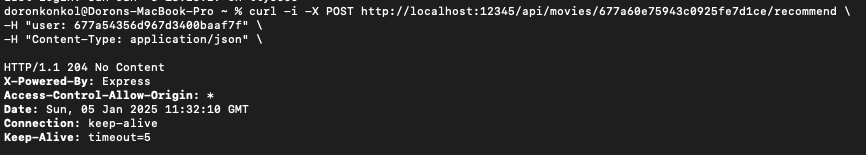

3. *Get* - Get a recommendation for a given user and a given movie from the cpp server
   ```
    curl -i http://localhost:12345/api/movies/<movie_id>/recommend \
    -H "user: <user_id_to_get_recommendation_for>" \
    -H "Content-Type: application/json"
   ```
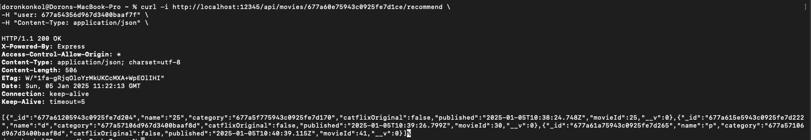

   
### Repository Link - [https://github.com/doronkon/catflix.git]
