# Welcome to Catflix!  

We are thrilled to present what we've been tirelessly working on over the past few months.  
Catflix is our take on a Netflix-style app and website, designed for an amazing streaming experience.  

We hope you enjoy it! 🎬🍿  

---

## Creating an Account  

When you launch the app, this is the screen you'll see—let's get started!  

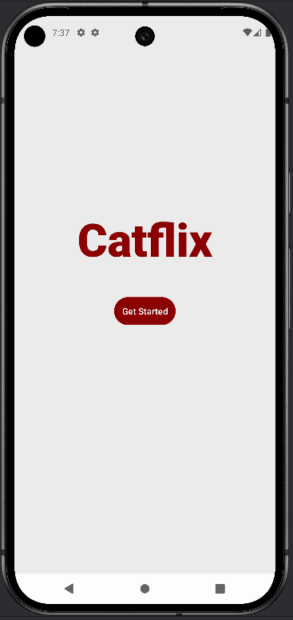  

This will lead you to the **Login screen**, where you can log in if you already have an account.  
If you don't, no worries! Click **Sign Up Now** to create one.  

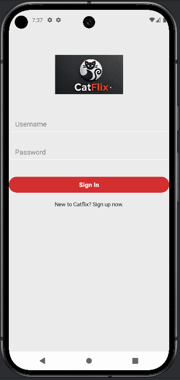  

Here, you can enter your details. A profile picture is optional—if you don’t upload one, the system will automatically generate one for you.  

After filling out your details, your form should look like this:  

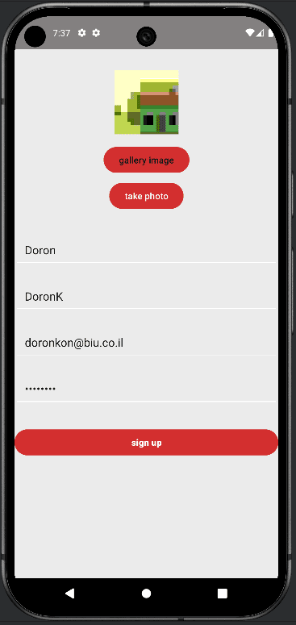  

Great! You’ve successfully created your Catflix account.  

Now, log in using the username and password you just set up.  

---

## Exploring the Home Page  

Welcome to Catflix! 🎉  

This is the **home page**, where you’ll see:  
- A **featured movie banner** playing a promoted title.  
- **Promoted categories** with their respective movies.  
- A section showing **movies you've previously watched**.  

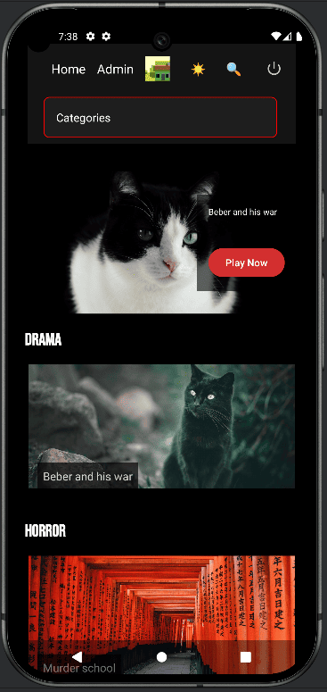  
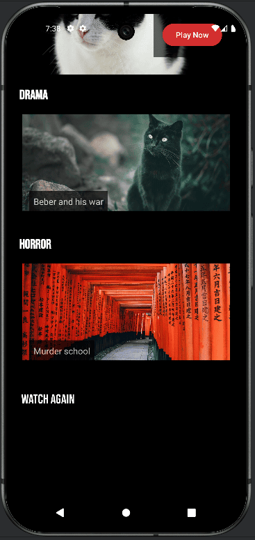  

---

## Admin Privileges  

By default, new users **do not** have admin rights. To gain admin privileges, you’ll need to:  
- Use `cURL` commands.  
- Modify your user data in MongoDB by adding an `admin` field and setting it to `true`.  

Once you have admin permissions, you'll unlock the **admin panel**, allowing you to manage content.  

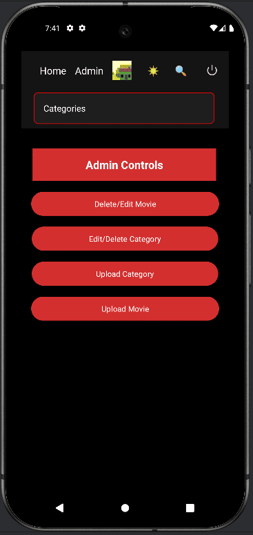  

---

## Managing Categories  

As an admin, you can create and manage movie categories.  

---

## Adding Movies  

On the **movie upload page**, you can:  
- Enter the movie’s **title, director, actors, and description**.  
- Assign it to a **category**.  

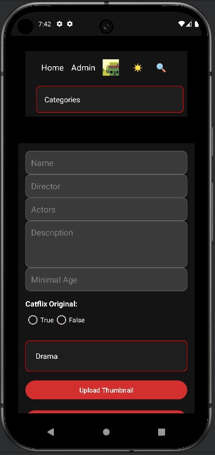  
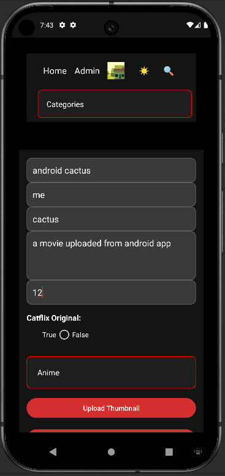  

Once added, the **new movie appears in its category**—and since it's in a promoted category, it's now featured in the homepage banner! 🎥  

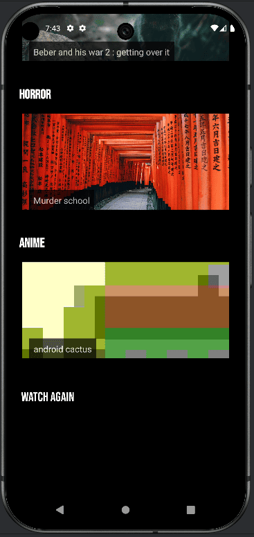  

---

## Browsing Categories  

From the **main menu**, you can explore all available categories and their movies:  

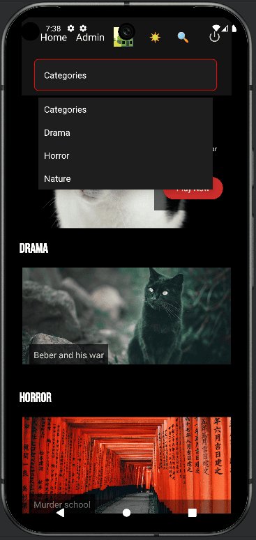  
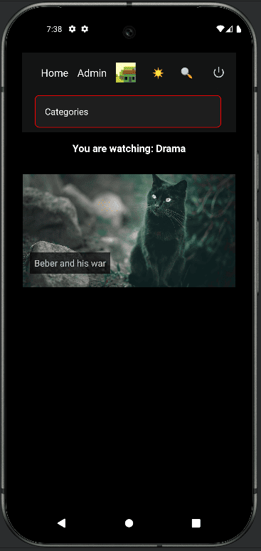  

---

## Watching a Movie  

Click on a movie you'd like to watch. You'll see a screen like this:  

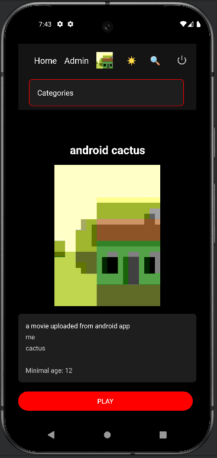  
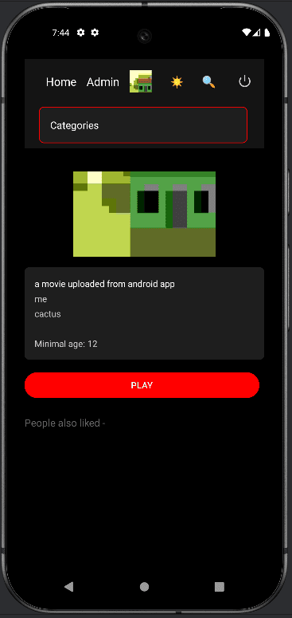  

At the top, you'll find:  
- The movie's **thumbnail**.  
- A **play button**.  
- The movie’s **details**.  
- A **slideshow of recommended movies** based on similar user preferences.  

Let’s watch some movies to generate recommendations!  

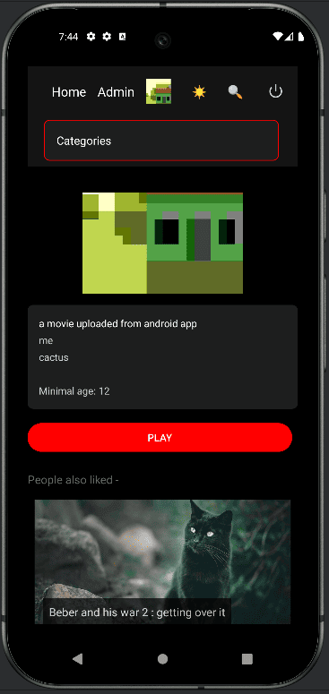  
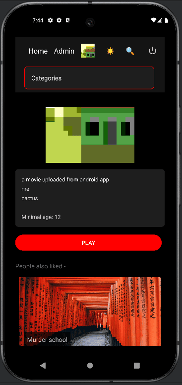  

---

## User Profile  

To access your profile, click on your **profile picture**.  

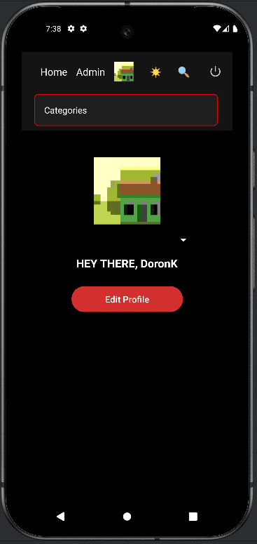  

You can **edit your profile**, but keep in mind:  
- Any field left **empty** will **not** be updated.  

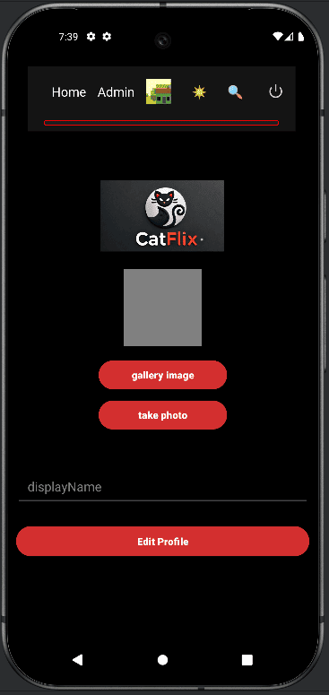  

---

## Managing Movies & Categories  

### Editing a Category  
Select a category, then update its **name** and **promotion status**.  

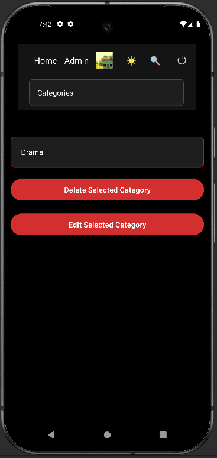  
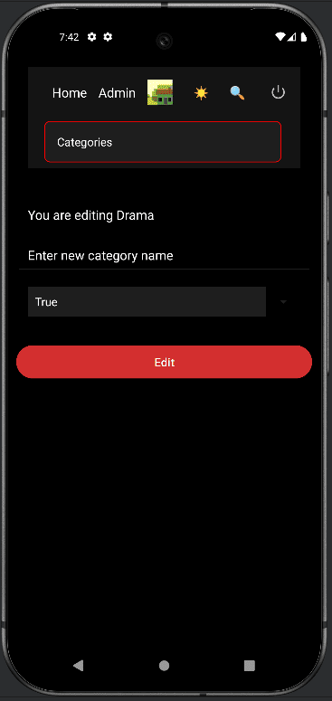  

### Editing or Deleting a Movie  
Choose a movie to **edit or delete** it.  

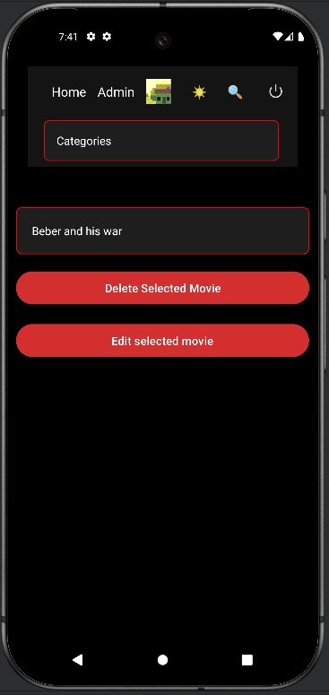  
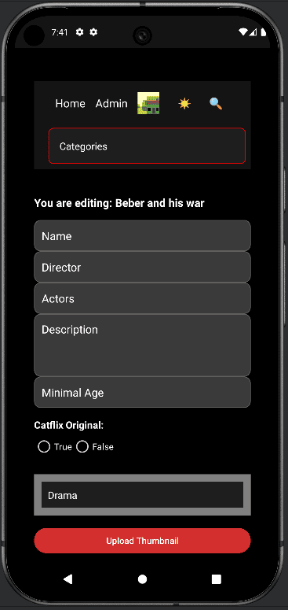  

**Note:** Any field left **empty** will **not** be updated.  

---

### Deleting a Category  
⚠ **Warning:** Deleting a category **removes all its movies!**  

---

## Enjoy Catflix!  

That’s it! Now you know how to:  
✅ **Create an account** and log in.  
✅ **Browse and watch movies**.  
✅ **Manage categories and movies** as an admin.  

We hope you love Catflix as much as we do! Happy watching! 🎥🍿  
