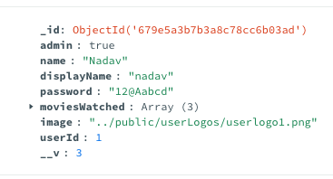

# Welcome to Catflix!  

We are excited to introduce **Catflix**, our Netflix-style streaming platform, crafted with dedication over the past few months.  
Catflix offers a seamless and immersive experience for streaming your favorite content.  

We hope you enjoy it! 🎬🍿  

---

## Getting Started  

Follow these steps to set up and run Catflix:  

### **1. Clone the Repository**  
```sh
git clone https://github.com/doronkon/catflix.git
```

### **2. Navigate to the Project Folder**  
```sh
cd Catflix
```

### **3. Run the Docker Containers**  
```sh
docker-compose up --build
```

---

## Granting Admin Privileges  

By default, new users do not have admin rights. To grant admin access, follow these steps:  

### **MongoDB Method**  
1. Open **MongoDB**.  
2. Locate the newly created user.  
3. Add a **boolean field** named `"admin"` and set it to `true`.  

Your user should now look like this:  

  

That's it! 🎉 You now have admin access.  

---

## Running the Android App  

To launch the **Catflix Android app**, follow these steps:  

1. **Ensure Docker is running.**  
2. Open the `catflix_android` folder in **Android Studio**.  
3. Click **Run** to start the app.  

---

## Accessing the Website  

Once everything is set up, open your browser and go to:  
```sh
http://localhost:8080/
```

Enjoy streaming with **Catflix**! 🎥  

---

### **Note for the Examiner**  

1. There are no **pull requests** in our repository, as all merges were conducted collaboratively in the presence of our three team members.  
You'll notice that **all merges were performed using Nadav's user account**.

2. Parts 1-3 and the React section of part 4 were done in this git repository - 
https://github.com/doronkon/Catflix.git
The android section of part 4 was done in this git repository - 
https://github.com/doronkon/catflix_android.git
3. for more info about the website and app go to react.md / android.md.

Thank you for reviewing our project! 🚀  


