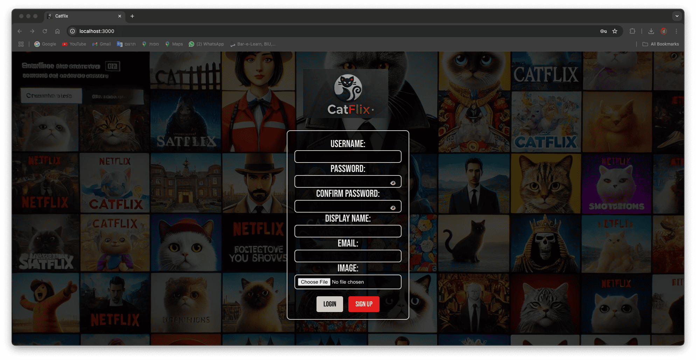
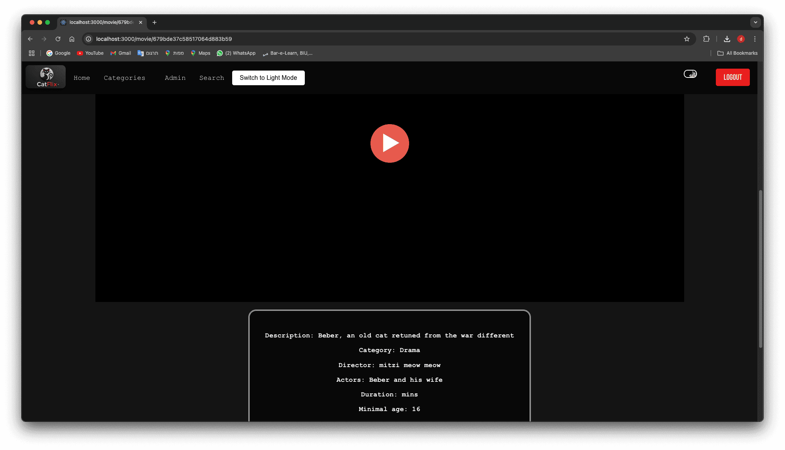

# Welcome to Catflix!

We are thrilled to present what we've been tirelessly working on over the past few months.  
Catflix is our take on a Netflix-style app and website, designed for an amazing streaming experience.  

We hope you enjoy it! 🎬🍿  

---

## Creating an Account  

First, let's create a new user:  

  

Here, you can enter your details. A profile picture is optional—if you don’t upload one, the system will automatically generate one for you.  

After filling out your details, your form should look like this:  

  

Great! You’ve successfully created your Catflix account.  

Now, log in using the username and password you just set up:  

  

---

## Exploring the Home Page  

Welcome to Catflix! 🎉  

This is the home page, where you’ll see:  
- A featured movie banner playing a promoted title.  
- Promoted categories with their respective movies.  
- A section showing movies you've previously watched.  

  

---

## Admin Privileges  

By default, new users do not have admin rights. To gain admin privileges, you’ll need to:  
- Use `cURL` commands.  
- Modify your user data in MongoDB by adding an `admin` field and setting it to `true`.  

Once you have admin permissions, you'll unlock the admin panel:  

  

---

## Managing Categories  

### Creating a Category  
As an admin, you can create new categories. Choose a name and decide if it should be promoted.  

  

Since we created a **promoted** category, it now appears on the home screen:  

  

---

## Adding Movies  

This category looks a little empty—let's add a movie to it!  

  

On the movie upload page, you can:  
- Enter the movie’s title, director, actors, and description.  
- Assign it to a category.  

  
  

Once added, the **new movie appears in its category**—and since it's in a promoted category, it's now featured in the homepage banner! 🎥  

  
  

Let’s create **another** promoted category and add a movie to it. Now, we have **two** promoted categories on the home page!  

  

---

## Browsing Categories  

From the main menu, you can explore all available categories and their movies:  

  
  

---

## Watching a Movie  

Click on a movie you'd like to watch. You'll see a screen like this:  

  
  
  

At the top, you'll find:  
- The movie's **thumbnail**.  
- A **play button**.  
- The movie’s **details**.  
- A **slideshow of recommended movies** based on similar user preferences.  

Let’s watch some movies to generate recommendations!  

  

---

## User Profile  

To access your profile, click on your profile picture at the **top-left corner**.  

  

You can **edit your profile**, but keep in mind:  
- Any field left **empty** will **not** be updated.  

  

---

## Managing Movies & Categories  

### Editing a Category  
Select a category, then update its **name** and **promotion status**.  
- Any field left **empty** will **not** be updated. 
  

### Editing or Deleting a Movie  
Choose a movie to **edit or delete** it.  
- Any field left **empty** will **not** be updated. 
  

Here’s an example of an edited movie:  

  

### Deleting a Category  
**Warning:** Deleting a category **removes all its movies!**  

  

---

## Enjoy Catflix!  

That’s it! Now you know how to:  
✅ Create an account and log in.  
✅ Browse and watch movies.  
✅ Manage categories and movies as an admin.  

We hope you love Catflix as much as we do! Happy watching! 🎥🍿  
